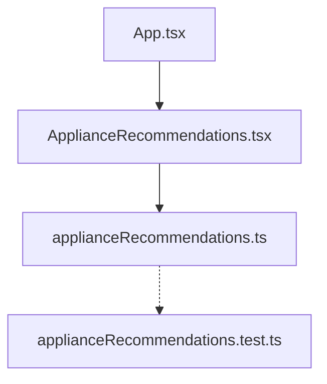

# Design: Appliance Consumption Recommendation Module

## Architectural Overview
This module introduces:
1. **Pure Utility Logic** (`src/utils/applianceRecommendations.ts`): Houses pure, testable mathematical algorithms for finding optimal consumption slots and categorizing hours.
2. **UI Component** (`src/components/ApplianceRecommendations.tsx`): A PrimeReact-supported, Tailwind-styled dark card dashboard widget.
3. **App Integration** (`src/App.tsx`): Integrates the new component in a responsive layout alongside existing components.



## Data Structures and Types
The utility module operates on the existing `HourlyPrice` interface:
```typescript
export interface HourlyPrice {
  hour: number;        // 0 to 23
  price: number;       // Price in €/kWh
  datetime: string;    // ISO string
}
```

We will introduce a return type for the best window function:
```typescript
export interface BestWindow {
  startHour: number;
  endHour: number;
  averagePrice: number;
}
```

We will also use the category type:
```typescript
export type HourCategory = 'cheap' | 'normal' | 'expensive';

export interface CategorizedHour {
  hour: number;
  price: number;
  category: HourCategory;
}
```

## Algorithmic Design

### 1. `findBestWindowForAppliance`
- **Input**: `prices: HourlyPrice[]`, `durationHours: number`
- **Output**: `BestWindow | null`
- **Logic**:
  1. Validate that `prices` is a non-empty array and `durationHours` is a positive integer less than or equal to `prices.length`. Otherwise, return `null`.
  2. Perform a sliding window calculation:
     - For each index $i$ from $0$ to `prices.length - durationHours`:
       - Calculate the sum of prices from index $i$ to $i + \text{durationHours} - 1$.
       - Calculate the average for this window.
       - Track the window with the minimum average price. If there is a tie, preserve the first one found.
  3. Return the `BestWindow` object with:
     - `startHour`: the `hour` property of the first element in the best window.
     - `endHour`: the `hour` property of the last element + 1 (or calculated correctly based on hour indices).
     - `averagePrice`: the minimum average found.

### 2. `categorizeHours`
- **Input**: `prices: HourlyPrice[]`, `averagePrice: number`
- **Output**: `CategorizedHour[]`
- **Logic**:
  1. Validate that `prices` is a non-empty array and `averagePrice > 0`. Otherwise, return an empty array.
  2. For each hourly record, determine its category:
     - If $\text{price} < 0.9 \times \text{averagePrice}$, category is `'cheap'`.
     - If $\text{price} > 1.1 \times \text{averagePrice}$, category is `'expensive'`.
     - Otherwise, category is `'normal'`.
  3. Return an array of `CategorizedHour` objects containing `hour`, `price`, and `category`.

### 3. Consecutive Hours Grouping Helper (for the UI)
To avoid rendering 24 individual hours and cluttering the traffic light section, we will group consecutive hours into ranges (e.g. `14:00 - 18:00` instead of `14, 15, 16, 17`):
- Sort the hours in ascending order.
- Group adjacent numbers into ranges.
- Formats ranges as `HH:00 - HH:00` (incorporating the end of the last hour). For example, hours `14, 15` are formatted as `14:00 - 16:00`.

## Component Design (`ApplianceRecommendations.tsx`)

### Props
```typescript
interface ApplianceRecommendationsProps {
  prices: HourlyPrice[];
  averagePrice: number;
}
```

### Layout and styling
The component is rendered within a premium, translucent dark card following the project's aesthetic:
- Card Container: `bg-slate-950/30 border border-slate-800/60 rounded-2xl p-6 space-y-6 shadow-xl`
- Headings: Outfit font, tracking-wide, bold, with custom gradients or clean gray tones.

#### Section 1: Optimización por Electrodomésticos
A responsive grid (`grid grid-cols-1 sm:grid-cols-2 lg:grid-cols-4 gap-4`):
- **Lavadora** (Washing Machine): Duration = 2 hours. Icon = `pi pi-cog` (emerald green text/bg).
- **Lavavajillas** (Dishwasher): Duration = 2 hours. Icon = `pi pi-sync` (cyan text/bg).
- **Horno** (Oven): Duration = 1 hour. Icon = `pi pi-database` (orange/amber text/bg).
- **Termo Eléctrico** (Water Heater): Duration = 3 hours. Icon = `pi pi-sliders-h` (indigo/violet text/bg).

Each card will have:
- Dark glassmorphic styling: `bg-slate-900/40 border border-slate-800/50 rounded-xl p-5 hover:border-slate-700/60 transition-all duration-300`
- Icon with a soft background glow.
- Optimal time window text (e.g. `14:00 - 16:00`).
- Average price for that slot formatted to 4 decimal places (e.g., `0.1124 €/kWh`).
- **Savings Badge**: Calculated relative to the maximum (peak) hour price of the day:
  $$\text{Savings \%} = \text{Math.round}\left(\left(1 - \frac{\text{windowAverage}}{\text{peakPrice}}\right) \times 100\right)$$
  If the peak price is 0, the savings is 0%.
  Style: `bg-emerald-500/10 text-emerald-400 text-xs font-semibold px-2 py-1 rounded-full border border-emerald-500/20`.

#### Section 2: Semáforo Energético de Hoy
A 2-column grid (`grid grid-cols-1 md:grid-cols-2 gap-6`):
- **Col 1 (Cheap Hours)**:
  - Header: 🟢 Horas más recomendadas (Baratas)
  - Layout: `bg-slate-950/40 border border-slate-900 rounded-xl p-4 space-y-3`
  - Display consecutive green ranges as badges or styled list items (e.g. `14:00 - 18:00`).
  - Color styling: emerald green text (`text-emerald-400`), borders, and subtle glows.
- **Col 2 (Expensive Hours)**:
  - Header: 🔴 Horas a evitar (Caras)
  - Layout: `bg-slate-950/40 border border-slate-900 rounded-xl p-4 space-y-3`
  - Display consecutive red ranges as badges or styled list items (e.g. `19:00 - 22:00`).
  - Color styling: rose red text (`text-rose-400`), borders, and subtle glows.

#### Section 3: Practical Tip Banner
- Banner styling: `p-4 bg-indigo-500/5 border border-indigo-500/10 rounded-xl flex items-start gap-3`
- Icon: `pi pi-info-circle text-indigo-400 mt-0.5`
- Text: `"Consejo: Programá tus electrodomésticos de alto consumo en las horas baratas. Si usás la lavadora a las 15:00 en lugar de las 21:00, podés ahorrar un gran porcentaje en tu factura."`

## Integration in `App.tsx`
Render the component directly in the main layout:
```tsx
if (stats) {
  return (
    <>
      <PriceSummary stats={stats} />
      <ApplianceRecommendations prices={prices} averagePrice={stats.averagePrice} />
      <PriceTable prices={prices} averagePrice={stats.averagePrice} />
    </>
  );
}
```
This guarantees that the recommendations are visible right after the general statistics cards and before the detailed table, creating a logical reading hierarchy.
