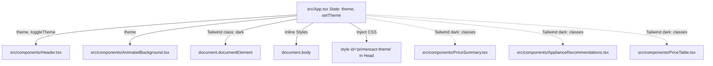
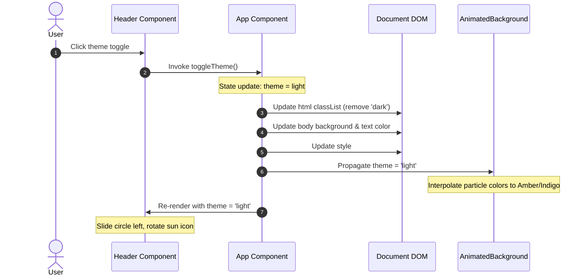

# Technical Design: Selector de Tema Dark/Light & Cambio Dinámico

This document details the architecture and design decisions for implementing the dynamic light/dark theme switching, the custom animated theme selector, the glassmorphic light mode overrides, and the interactive canvas particle background.

## 1. System Architecture

The application employs a unidirectional data flow, managing the global `theme` state at the root level (`src/App.tsx`) and distributing it to descendant components via props.



### Theme Lifecycle & Flow Sequence

When a user triggers the theme toggle:
1. The click event on the toggle pill in the `Header` invokes the `toggleTheme` callback.
2. The `theme` state in `App.tsx` toggles between `'dark'` and `'light'`.
3. A React `useEffect` hook responds to the state change:
   - It toggles the `dark` class on the root `<html>` element (`document.documentElement`), enabling Tailwind's `dark:` selectors.
   - It updates `document.body`'s background and text colors inline to prevent any flash of light/dark background during rendering.
   - It retrieves the corresponding CSS string (imported inline using Vite's `?inline` parameter) and updates the inner content of the `<style id="primereact-theme">` element.
4. The state change propagates to `AnimatedBackground.tsx`, which triggers an interpolation of particle colors.



---

## 2. Component Design & Implementation

### 2.1. Dynamic Stylesheet Injection
To prevent importing massive CSS blocks that conflict, both Lara Dark Blue and Lara Light Blue themes are imported using Vite's inline suffix:
```typescript
import darkTheme from "primereact/resources/themes/lara-dark-blue/theme.css?inline";
import lightTheme from "primereact/resources/themes/lara-light-blue/theme.css?inline";
```
This tells Vite to load the CSS files as plain strings rather than injecting them into the document automatically.
We manage their injection in `App.tsx`:
```typescript
useEffect(() => {
  const root = document.documentElement;
  const body = document.body;
  
  // 1. Toggle Tailwind dark class
  if (theme === 'dark') {
    root.classList.add('dark');
    body.style.backgroundColor = '#0b0f19';
    body.style.color = '#f3f4f6';
  } else {
    root.classList.remove('dark');
    body.style.backgroundColor = '#f8fafc';
    body.style.color = '#0f172a';
  }

  // 2. Inject PrimeReact theme CSS
  let styleTag = document.getElementById('primereact-theme') as HTMLStyleElement;
  if (!styleTag) {
    styleTag = document.createElement('style');
    styleTag.id = 'primereact-theme';
    document.head.appendChild(styleTag);
  }
  styleTag.textContent = theme === 'dark' ? darkTheme : lightTheme;
}, [theme]);
```

### 2.2. Premium Animated Theme Selector (`Header.tsx`)
The Header toggle is designed as a premium custom input, avoiding browser defaults or generic styles.
- **Pill Container**:
  - CSS: `w-14 h-8 rounded-full bg-slate-800 dark:bg-slate-950/40 border border-slate-700 dark:border-slate-800/60 relative cursor-pointer transition-all duration-300 shadow-inner flex items-center`
  - Hover: subtle scaling (`hover:scale-105`) and border illumination.
- **Slider Circle**:
  - CSS: `w-6 h-6 rounded-full bg-indigo-600 dark:bg-indigo-500 absolute top-1 flex items-center justify-center transition-all duration-300 transform shadow-md`
  - Position:
    - Light mode: `left-[4px]`
    - Dark mode: `left-[30px]`
- **Icons & Micro-animations**:
  - Light mode: sun icon (`pi pi-sun text-amber-100 text-xs animate-spin-slow`) spinning slowly to represent energy.
  - Dark mode: moon icon (`pi pi-moon text-indigo-100 text-xs animate-pulse`) pulsing gently to represent tranquility.
  - Rotation/Spin animation is custom-defined in CSS if needed, or using PrimeIcons combined with standard Tailwind transition classes.

### 2.3. Interactive Particle Canvas Background (`AnimatedBackground.tsx`)
A high-performance HTML5 `<canvas>` background:
- **Canvas Element**: Fixed full screen, background index `-z-10`, click-through (`pointer-events-none`).
- **Performance Budget**: Strict cap at 50-60 particles. Particle velocities are small to ensure a smooth, subtle drift.
- **Interactive Mouse Repulsion**:
  - Listens to `mousemove` on the window.
  - Stores `mouse.x` and `mouse.y`.
  - In the animation loop, for each particle:
    - Calculate distance `dx = particle.x - mouse.x`, `dy = particle.y - mouse.y`.
    - Distance `dist = Math.sqrt(dx*dx + dy*dy)`.
    - If `dist < repulsionRadius` (e.g., 120px):
      - Compute repulsion force: `force = (repulsionRadius - dist) / repulsionRadius`.
      - Compute angle: `angle = Math.atan2(dy, dx)`.
      - Adjust particle position by adding force vectors: `x += Math.cos(angle) * force * repulsionStrength`, `y += Math.sin(angle) * force * repulsionStrength`.
- **Dynamic Theme Adaptability**:
  - The component accepts `theme` as a prop.
  - Particles have target colors matching the theme:
    - Dark: `#818cf8` (indigo-400), `#a78bfa` (violet-400), `#22d3ee` (cyan-400).
    - Light: `#f59e0b` (amber-500), `#6366f1` (indigo-500).
  - When the theme changes, existing particles smoothly transition their colors toward the new palette to avoid abrupt pops.
- **Resource Management**:
  - Properly removes window event listeners (`mousemove`, `resize`).
  - Cancels the active `requestAnimationFrame` using the stored frame ID on component unmount.

### 2.4. Glassmorphism Light Mode Overrides
To create a stunning visual contrast, cards in Light Mode will adopt a modern glassmorphism design:
- **Light Mode Cards**: `bg-white/80 border-slate-200/80 backdrop-blur-md shadow-sm text-slate-800`
- **Dark Mode Cards**: `bg-slate-950/30 border-slate-800/60 backdrop-blur-md shadow-xl text-slate-100`
- Badges and highlights are recolored (e.g., green/red tags use softer tones in light mode to maintain readability and avoid aggressive contrasts).

---

## 3. Architecture Decisions & Rationales

### 3.1. Dynamic Stylesheet Injection via `?inline`
- **Decision**: Avoid importing both CSS files globally or swapping `<link>` tags pointing to public directories. Instead, use Vite's `?inline` query suffix and inject via React `useEffect` in a `<style>` tag.
- **Rationale**: Swap of public link tags triggers network requests on every switch, causing visible flashes of unstyled content (FOUC). Swapping string content in a `<style>` tag is instantaneous and local, ensuring a flawless visual transition.

### 3.2. Canvas-based Particles vs. CSS Particles
- **Decision**: Use HTML5 canvas with a controlled rendering loop instead of spawning 50+ absolute-positioned HTML `div` elements animated with CSS.
- **Rationale**: 50+ DOM nodes with blur filters and mouse collision tracking trigger constant layout recalculations, degrading performance on lower-end devices. A single `<canvas>` bypassing the DOM tree and drawing directly to the bitmap offers 60fps performance with negligible CPU overhead.

---

## 4. Performance and Safety Gates
- **Type Safety**: Prop interfaces strictly defined. Props for `Header` and `AnimatedBackground` must be fully typed in TypeScript.
- **Event Listeners**: Scroll, resize, and mouse movements must be throttled or properly cleaned up to prevent memory leaks.
- **Aesthetic Refinements**: High-contrast ratios for text in light mode (minimum 4.5:1 compliant with WCAG AA guidelines) are respected by choosing Slate-800/900 for texts and Slate-500 for captions on a white-translucent background.
