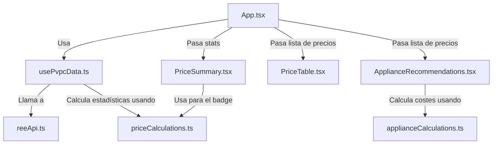

# Design: Refactor to Feature-Based Clean Architecture & Current Price Status Badge

Este documento detalla las especificaciones de diseño, la estructura de directorios modular, las relaciones de dependencia, y los flujos de datos para el cambio `refactor-clean-architecture`.

---

## 1. Nueva Estructura de Directorios (Screaming Architecture)

La migración reorganiza la aplicación agrupándola por dominios de negocio (features) en lugar de tipos técnicos de React. Esto facilita la mantenibilidad, escalabilidad y la encapsulación de responsabilidades.

```text
src/
├── core/
│   └── layout/                        # Componentes comunes estructurales
│       ├── Header.tsx                 # Barra de navegación superior
│       └── Footer.tsx                 # Pie de página con créditos
├── features/
│   ├── theme/                         # Dominio de UI global y fondo animado
│   │   ├── components/
│   │   │   └── AnimatedBackground.tsx
│   │   └── hooks/
│   │       └── useTheme.ts            # Gestión de modos claro/oscuro (si procede)
│   ├── prices/                        # Dominio de Precios de la tarifa PVPC
│   │   ├── components/
│   │   │   ├── PriceSummary.tsx       # Presentacional: Tarjetas con métricas
│   │   │   └── PriceTable.tsx         # Presentacional: Tabla de precios por horas
│   │   ├── hooks/
│   │   │   └── usePvpcData.ts         # Contenedor: Orquesta llamadas, estado de carga/error y cache
│   │   ├── services/
│   │   │   └── reeApi.ts              # Infraestructura: Peticiones HTTP a esios/REE
│   │   └── utils/
│   │       └── priceCalculations.ts   # Dominio: Algoritmos puros de clasificación y estadísticas
│   └── appliances/                    # Dominio de consumo de electrodomésticos
│       ├── components/
│       │   └── ApplianceRecommendations.tsx # Presentacional: Recomendaciones de uso
│       ├── config/
│       │   └── appliancesConfig.ts    # Datos estáticos de electrodomésticos
│       └── utils/
│           └── applianceCalculations.ts # Dominio: Cálculos de coste de operación por hora
```

---

## 2. Aplicación del Patrón Contenedor-Presentacional

### Contenedor (Hook: `usePvpcData`)
- **Responsabilidad:** Gestionar el ciclo de vida del fetch de datos, estado de carga (`loading`), control de errores (`error`), caché en memoria/local (si aplica) y la estructuración del estado crudo del PVPC.
- **Salida:** Retorna un objeto con la lista completa de precios del día, las estadísticas calculadas (`PriceStats`) y el estado del ciclo de vida.
- **Independencia:** No realiza renderizado directo de HTML. Es pura lógica de negocio y estado React.

### Componentes Presentacionales
- **Responsabilidad:** Recibir propiedades estáticas y renderizar la interfaz de usuario con Tailwind CSS.
- **Componentes:**
  - `PriceSummary`: Recibe `stats: PriceStats` y dibuja las 4 tarjetas informativas.
  - `PriceTable`: Recibe la lista de precios y la media aritmética para renderizar la tabla interactiva.
  - `ApplianceRecommendations`: Recibe la lista de precios y la configuración de electrodomésticos para computar y listar los costes de uso recomendados.

---

## 3. Diseño del Badge de Estado en "Precio ahora"

La tarjeta de "Precio ahora" mostrará una insignia que clasifica el precio respecto a la media del día actual.

### Definición del Componente Badge
Se incluirá dentro de la tarjeta "Precio ahora" en `PriceSummary.tsx`:

```tsx
// Dentro de PriceSummary.tsx
// stats.currentPrice y stats.averagePrice se usan para calcular la clasificación

const classification = classifyPrice(currentPrice, averagePrice);

// Renderizado del badge:
<span className={`inline-flex items-center gap-1.5 px-2.5 py-0.5 rounded-full text-xs font-semibold border ${badgeStyles[classification].class}`}>
  <span className={`h-1.5 w-1.5 rounded-full ${badgeStyles[classification].dotClass}`} />
  {badgeStyles[classification].label}
</span>
```

### Tabla de Estilos y Clases CSS

| Estado | Umbral | Clases del Contenedor | Clase del Punto Visual | Etiqueta |
| :--- | :--- | :--- | :--- | :--- |
| **Barata** | $< 90\%$ de la media | `bg-emerald-50 text-emerald-700 border-emerald-200 dark:bg-emerald-950/30 dark:text-emerald-400 dark:border-emerald-800/30` | `bg-emerald-500` | Barata |
| **Normal** | $90\% \le \text{precio} \le 110\%$ | `bg-blue-50 text-blue-700 border-blue-200 dark:bg-blue-950/30 dark:text-blue-400 dark:border-blue-800/30` | `bg-blue-500` | Normal |
| **Cara** | $> 110\%$ de la media | `bg-rose-50 text-rose-700 border-rose-200 dark:bg-rose-950/30 dark:text-rose-400 dark:border-rose-800/30` | `bg-rose-500` | Cara |

---

## 4. Flujos de Datos y Relaciones de Dependencia

### Diagrama de Flujo de Datos


### Firma de Funciones Clave

#### `priceCalculations.ts`
```typescript
export interface PriceData {
  hour: number;
  price: number;
}

export interface PriceStats {
  averagePrice: number;
  cheapestHour: PriceData | null;
  expensiveHour: PriceData | null; // Opcional
  currentPrice: number | null;
  bestInterval: {
    startHour: number;
    averagePrice: number;
  } | null;
}

export function calculatePriceStats(prices: PriceData[]): PriceStats;
export function classifyPrice(price: number, averagePrice: number): "cheap" | "normal" | "expensive";
```

#### `usePvpcData.ts`
```typescript
export function usePvpcData(): {
  prices: PriceData[];
  stats: PriceStats | null;
  loading: boolean;
  error: string | null;
  refetch: () => Promise<void>;
};
```
